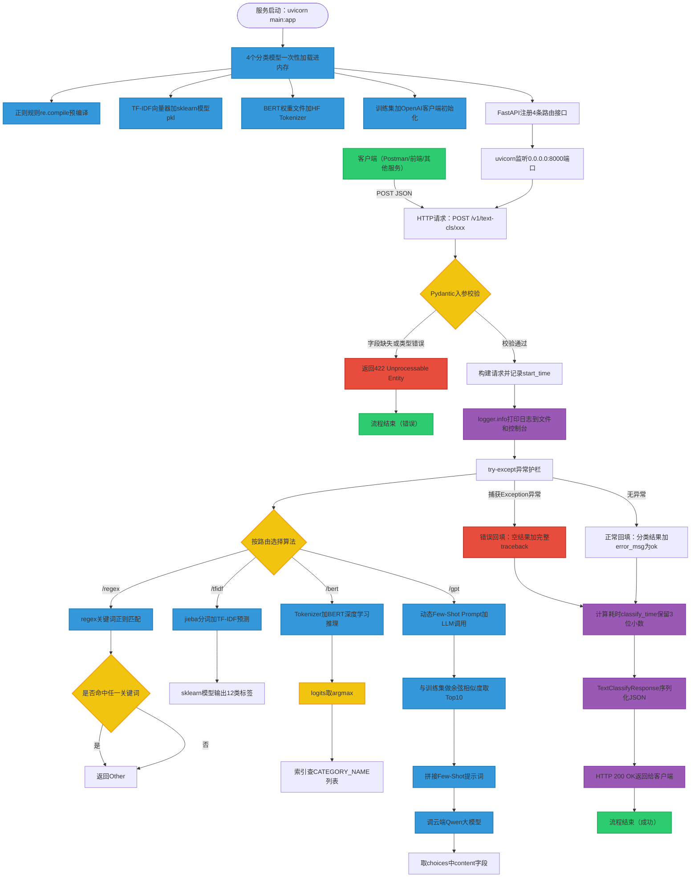

# FastAPI 请求处理全链路流程图

> 本文档完整展示「意图分类服务」从 HTTP 请求到达，到 4 种算法（Regex / TF-IDF / BERT / GPT）完成推理并返回结果的完整流程。
> 本文件 Mermaid 语法已针对 GitHub 做了兼容性处理（避免 HTML 标签与特殊符号），可直接在 GitHub 渲染。

---

## 一、总体架构图（Mermaid）

---

## 二、4 种算法接口路由速查

| HTTP 方法 | 路由 | 算法 | 速度 | 精度 |
|---------|------|------|------|------|
| POST | /v1/text-cls/regex | 正则关键词匹配 | 最快 | 最低 |
| POST | /v1/text-cls/tfidf | TF-IDF 加 传统机器学习 | 快 | 中等 |
| POST | /v1/text-cls/bert | BERT 深度学习 | 慢 | 最高 |
| POST | /v1/text-cls/gpt | LLM 加 动态 Few-Shot | 最慢 | 泛化最优 |

---

## 三、请求生命周期详解

### 阶段 1：服务启动预热（一次性执行）
1. `uvicorn main:app` 启动进程
2. 4 个模型文件自动执行模块级代码
3. FastAPI 注册 4 条 POST 路由

### 阶段 2：请求接收
1. HTTP POST 请求到达 `0.0.0.0:8000/v1/text-cls/{algo}`
2. FastAPI 用 `TextClassifyRequest` 做 Pydantic 校验
3. 校验失败返回 422，校验通过进入业务逻辑

### 阶段 3：业务逻辑模板
1. `start_time = time.time()`
2. `logger.info` 打印请求信息到文件加控制台
3. `try except` 调用对应 `model_for_*` 函数
4. 成功：填 classify_result，error_msg 设为 ok
5. 失败：填空 classify_result，error_msg 写完整 traceback
6. 计算 classify_time，保留 3 位小数

### 阶段 4：响应返回
1. Pydantic 自动序列化 TextClassifyResponse 为 JSON
2. HTTP 200 返回给客户端，Body 包含：
   - request_id
   - request_text
   - classify_result
   - classify_time
   - error_msg

---

