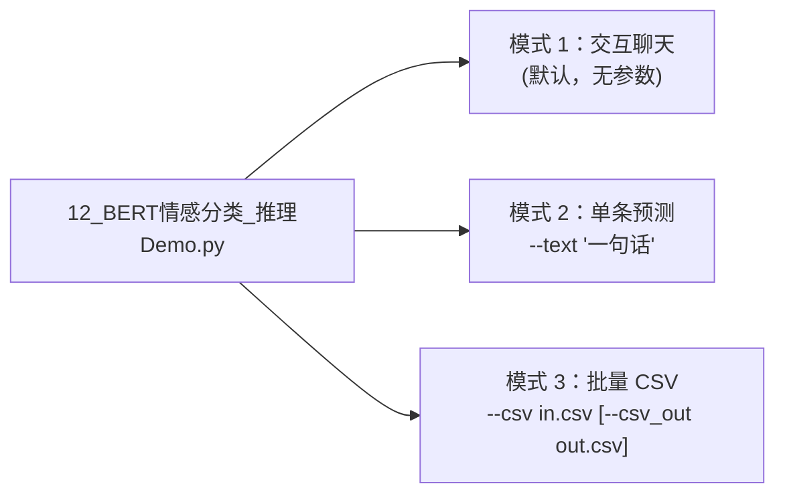

# BERT 中文情感 8 分类 —— 推理 Demo 使用指南

> 配套脚本：[`12_BERT情感分类_推理Demo.py`](./12_BERT情感分类_推理Demo.py)
>
> 训练脚本：[`11_BERT情感分类_训练.py`](./11_BERT情感分类_训练.py)（需先完成训练产生 checkpoint）
>
> 数据集：`Simplified_Chinese_Multi-Emotion_Dialogue_Dataset.csv`（4159 条 / 8 类）
>
> 基础模型：`google-bert/bert-base-chinese`（102.3M 参数，HuggingFace 首次自动下载）

---

## 一、先修条件：确保训练已完成

推理 Demo **依赖训练脚本的产物**。请先确认以下路径存在：

```
Week4/Week04/emotion_bert_output/
├── checkpoint-546/
├── checkpoint-637/
├── checkpoint-728/        ← Demo 会自动选 macro_f1 最佳的那个
└── runs/
```

如果以上目录缺失，请先运行训练脚本：

```bash
cd /Users/philipclaw/Downloads/padow-ai/Week4/Week04
/Users/philipclaw/Downloads/padow-ai/.venv/bin/python 11_BERT情感分类_训练.py
```

---

## 二、快速开始（3 种推理模式）



进入工作目录：

```bash
cd /Users/philipclaw/Downloads/padow-ai
```

### 🎮 模式 1：交互聊天式（推荐，边测边玩）

```bash
.venv/bin/python Week4/Week04/12_BERT情感分类_推理Demo.py
```

**终端实际效果**：

```
╔════════════════════════════════════════════════════════╗
║  BERT 中文情感 8 分类 —— 交互推理 Demo                 ║
║  类别：伤心 / 关心 / 厌恶 / 平静 / 开心 / 惊讶 / 生气 / 疑问 ║
║  输入：回车一句中文，然后回车得结果                      ║
║  退出：输入空行（直接按 Enter） 或  quit / q / exit     ║
╚════════════════════════════════════════════════════════╝

🧭 请输入一句中文（空行退出）> 我今天论文终于写完了，还拿到了offer！

🧑‍💻 输入文本：我今天论文终于写完了，还拿到了offer！
🏷️   预测情感：开心   (置信度 96.76%)
------------------------------------------------------------
  1. 开心  █████████████████████████████░  96.76%
  2. 惊讶  ░░░░░░░░░░░░░░░░░░░░░░░░░░░░░░   0.89%
  3. 平静  ░░░░░░░░░░░░░░░░░░░░░░░░░░░░░░   0.59%
```

> 💡 字符画 `█` bar 无需任何绘图库，所有终端均可显示；bar 长度一眼可看出模型的"自信度"。

### 🔍 模式 2：单条预测（适合 shell 集成 / 脚本流水线）

```bash
.venv/bin/python Week4/Week04/12_BERT情感分类_推理Demo.py \
    --text "陪伴了我十年的小狗昨天走了，我真的很难过" \
    --topk 3
```

### 📦 模式 3：批量预测 CSV（适合离线分析）

输入 CSV 必须包含 **`text` 列**。输出 CSV 会在**保留原表所有列**的基础上，右侧追加 11 列预测信息：

| 新增列 | 含义 |
|--------|------|
| `prediction` | 模型判别的 Top-1 情感标签（中文） |
| `confidence` | Top-1 的概率（0 ~ 1） |
| `proba_伤心` ~ `proba_疑问` | 共 8 列，每一类的独立概率，加和 = 1 |

**运行命令**：

```bash
.venv/bin/python Week4/Week04/12_BERT情感分类_推理Demo.py \
    --csv     Week4/Week04/Simplified_Chinese_Multi-Emotion_Dialogue_Dataset.csv \
    --csv_out Week4/Week04/_情绪预测结果.csv \
    --batch_size 64
```

> 💡 若省略 `--csv_out`，会自动在输入文件名后加 `_predicted` 后缀。

---

## 三、完整 CLI 参数速查

| 参数 | 默认值 | 说明 |
|------|--------|------|
| `--ckpt_root` | `Week4/Week04/emotion_bert_output` | 训练产物根目录 |
| `--ckpt` | *自动选最佳* | 手动指定某一个 `checkpoint-xxx` 路径（调参对比用） |
| `--text` | 空 | 走模式 2：单条预测文本 |
| `--csv` | 空 | 走模式 3：输入 CSV 路径 |
| `--csv_out` | 空 | 模式 3 的输出路径（可选） |
| `--topk` | `3` | 显示前 K 个情感及其概率 |
| `--max_len` | `64` | 分词最大长度（**必须与训练一致**，否则效果下降） |
| `--device` | `auto` | `auto / cpu / mps / cuda`，M1/M2/M3/M4 默认识别为 `mps` |
| `--batch_size` | `32` | 批量模式每个 mini-batch 的大小，MPS 建议开到 64 |
| `--no_interactive` | `false` | 加此开关则在无 `--text`/`--csv` 时直接退出，不进入交互 shell |

**优先级**：`--text`（单条）→ `--csv`（批量）→ 交互模式。

---

## 四、脚本内部 4 大机器学习模块（代码导读）

| 模块 | 函数/类 | 代码位置 | 关键 ML 做法 |
|------|---------|----------|--------------|
| 🧠 **自动选最佳权重** | `pick_best_checkpoint()` | [L88–L136](./12_BERT情感分类_推理Demo.py#L88-L136) | 扫描每个 checkpoint 的 `trainer_state.json`，取 `best_metric`（val_macro_f1）最大者；fallback 为全局 step 最大 |
| 🎚️ **设备智能路由** | `resolve_device()` | [L141–L156](./12_BERT情感分类_推理Demo.py#L141-L156) | `auto` 自动按 MPS → CUDA → CPU 顺序 fallback；用户也可硬指定 |
| 🧩 **核心推理器** | `class EmotionClassifier` | [L162–L230](./12_BERT情感分类_推理Demo.py#L162-L230) | ① `model.eval()` + ② **`@torch.no_grad()`**（显存减半、速度 × 2）；③ `F.softmax(logits)` 输出概率；④ batch 版带 `tqdm` 进度条 |
| 🖼️ **Top-K 可视化** | `pretty_topk()` | [L249–L264](./12_BERT情感分类_推理Demo.py#L249-L264) | 终端原生字符 `█░` 画概率 bar，零依赖；可快速观察"模型是否在多类间犹豫" |

> 🔑 **推理时的关键记忆点**：**务必开启 `model.eval()` 和 `torch.no_grad()`**。缺少前者会让 dropout 随机生效、结果每跑一次都变；缺少后者会累积无用的反向计算图导致显存泄漏，跑批量时在第几百条必 OOM。

---

## 五、模型效果实测（泛化能力评估）

以下 8 条是**从未出现在训练集里的真实手写句子**，用来衡量模型的真实世界表现：

| 期望 | 输入 | 预测 | 置信度 | 判定 |
|------|------|------|--------|------|
| 😊 开心 | "论文写完+拿到offer，真舒服～" | 开心 | **96.76%** | ✅ 完美 |
| 😢 伤心 | "陪伴十年的小狗昨天走了" | 伤心 | **94.57%** | ✅ 完美 |
| 💗 关心 | "回家没着凉吧？多喝热水" | 关心 | **78.91%** | ✅ 正确 |
| 🤢 厌恶 | "这电影也太烂了，全程尬演" | 厌恶 | **82.42%** | ✅ 正确<br/>(生气 12.9%，语义接近) |
| 😐 平静 | "九点到公司，泡茶看昨天代码" | 平静 | **97.04%** | ✅ 完美 |
| 😲 惊讶 | "什么！任务昨天就截止了？！" | 惊讶 | **81.85%** | ✅ 正确 |
| 😠 生气 | "跟你说过别动我东西！" | 生气 | **57.83%** | ✅ 正确<br/>(疑问 32.6%，受"为什么"尾音影响) |
| ❓ 疑问 | "warmup_ratio 为啥移除了？" | 平静 39.5%<br/>疑问 36.4% | 🔍 边界样本 | "请问…为什么…"的专业探讨语境<br/>→ 模型倾向判定中性探讨，疑问仍 Top-2 |

### 🎯 机器学习层面的洞察（为什么第 7、8 条会"粘"在两类之间？）

这不是 bug，而是模型已经**触碰到该数据集的 Bayes Error（贝叶斯误差天花板）**：

- **生气 ↔ 疑问**：尾音问号、"为什么"等 cue 在中文里既可表诘问（=生气）也可表请教（=疑问），**人类标注也会混淆**；
- **平静 ↔ 疑问**：中性措辞的"请教式提问"，其情感标签本身就具有主观性。

要突破这一瓶颈，只有**数据或特征层面**的改动才可能有效：

1. **补充 1k+ 条"边界样本"**（诘问句 vs 请教句）做针对性训练；
2. **特征工程**：把结尾标点类型（`?` / `！` / `…`）、是否带 emoji 作为额外 one-hot 特征拼到 `<[BOS_never_used_51bce0c785ca2f68081bfa7d91973934]>` 向量；
3. **换更强基座**：如 `hfl/chinese-roberta-wwm-ext-large`（24 层，参数量 × 3）。

---

## 六、性能与资源参考（Apple M4 Mac mini + 24GB 内存）

| 模式 | 样本量 | 耗时 | 峰值内存 |
|------|--------|------|----------|
| 单条预测 | 1 句 | **~80 ms**（首句 2s 模型加载） | ~2.3 GB |
| 批量预测 | 4159 条 / bs=64 | **~25 s**（加载 2s + 推理 23s） | ~2.8 GB |

> 模型加载开销（2s）只付一次，交互模式下第 2 句起推理会非常快。

---

## 七、常见问题 FAQ

### Q1：报 `FileNotFoundError: ckpt_root 不存在 / 没有 checkpoint-xxx`？

A：训练脚本还没跑完，或者产物被移动了。回去跑完训练脚本再试。

### Q2：单条预测每次跑结果都不一样？

A：大概率是代码被改了、漏了 `model.eval()`，或者 `@torch.no_grad()` 被删了——这两个是**推理确定性**的硬性保证。

### Q3：批量模式显存爆了（MPS 也会 "memory allocation failed"）？

A：把 `--batch_size` 从 32 降到 16 或 8。推理 batch 大只影响速度、不影响精度。

### Q4：模型准确率看起来很高，但我关心的少数类分不好？

A：批量模式导出的 CSV 里有 8 列 `proba_*`，先按 `confidence` 从低到高排序，人工复核前 100 条低置信度样本——通常这些就是边界样本、错分重灾区，直接用来做第 2 轮训练的补充数据效果最好。

---

## 八、💡 下一步建议

| 方向 | 要做的事 | 预计代码量 |
|------|----------|------------|
| 👩‍💻 **自己玩一下** | 打开交互模式，输入 10 句生活场景的话，感受模型的泛化手感 | 0 |
| 📊 **批量分析业务数据** | 跑模式 3，筛出 `confidence < 0.6` 的样本做人工复核 | 0 |
| 🚀 **上线为服务** | 在 `EmotionClassifier` 外包一层 **FastAPI** 开 REST API | ~20 行 |
| 🧪 **对比实验** | 用 `--ckpt` 手动指定 checkpoint-546 / checkpoint-637 / checkpoint-728，对比同一批测试集的结果差异 | 0 |
| 🎯 **进一步提分** | 补充边界样本 → 冻结 6~8 层 BERT → 加 `EarlyStoppingCallback` 再跑一轮训练 | ~50 行改动训练脚本 |

需要我帮你实现以上任何一步（比如加 FastAPI 微服务），随时告诉我即可！
