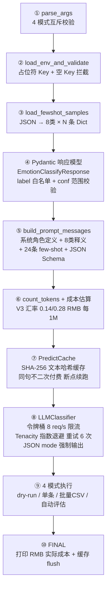
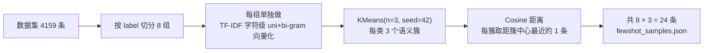

# LLM Few-Shot 中文意图（情感）8 分类

> 项目定位：基于**通用大语言模型 + Few-Shot Prompting** 做中文 8 类情感/意图分类，用于对比 **BERT 有监督微调** 的精度与成本。
>
> 配套项目：[BERT 微调情感分类 README](./README_BERT情感分类推理Demo.md)

---

## 一、项目文件总览（5 个核心文件）

| 路径 | 作用 | 必须 |
|------|------|------|
| [`13_LLM情感分类_FewShot.py`](./13_LLM情感分类_FewShot.py) | **主脚本**（4 种运行模式：dry-run / 单条 / 批量 CSV / 自动评估）| ✅ |
| [`fewshot_samples.json`](./fewshot_samples.json) | **24 条 few-shot 样本库**（8 类 × 3 条，TF-IDF + KMeans 簇中心代表性样本）| ✅ |
| [`fewshot_samples.md`](./fewshot_samples.md) | 24 条样本的人类可读视图（含簇中心相似度）| 📖 参考 |
| [`.env.example`](../.env.example) | 环境变量模板（API Key / 模型 / 速率限制 / 安全阈值 8 项）| ✅ |
| `llm_classify_cache.json`（运行后生成）| **断点续跑缓存**（SHA-256 文本哈希 → 分类结果，同句不重复花钱）| ♻️ 自动生成 |

---

## 二、8 类情感/意图标签定义

本任务为**8 类互斥多分类**（Softmax / 单标签）：

| ID | 标签 | 典型语义 |
|----|------|----------|
| 0 | `伤心` | 难过、悲伤、失落、痛苦、心碎、怀旧惋惜 |
| 1 | `关心` | 对他人关怀、问候、担心、慰问、体贴 |
| 2 | `厌恶` | 厌烦、嫌弃、不满、反感、恶心、讨厌 |
| 3 | `平静` | 中性、客观描述、无明显情绪、日常对话 |
| 4 | `开心` | 喜悦、高兴、满足、惊喜、兴奋、幸福 |
| 5 | `惊讶` | 意外、震惊、出乎意料、吃惊 |
| 6 | `生气` | 愤怒、不满、愤慨、恼火、斥责、抓狂 |
| 7 | `疑问` | 提问、怀疑、不理解、咨询好奇 |

> 这 8 类在 `Pydantic` 响应模型中被硬编码为**白名单**。LLM 若输出任何其它词（如「愉悦」「怀疑」「担忧」）会自动触发十acity 重试，避免幻觉污染评测集。

---

## 三、快速开始（3 步）

### 步骤 1：安装依赖（一次性）

```bash
cd /Users/philipclaw/Downloads/padow-ai
.venv/bin/pip install openai python-dotenv tenacity tiktoken scikit-learn pandas numpy
```

> 项目的 Python 虚拟环境路径：`/Users/philipclaw/Downloads/padow-ai/.venv`

### 步骤 2：配置 `.env`（填入 DeepSeek API Key）

```bash
cp .env.example .env
```

**编辑 `.env` 文件，至少修改下面 1 行**（其它 7 项可保留默认）：

```dotenv
# ================ 🔑 至少改这 1 行！===============
DEEPSEEK_API_KEY=sk-这里替换成你的真实Key

# ================ 以下保持默认即可 ===============
DEEPSEEK_BASE_URL=https://api.deepseek.com/v1
DEEPSEEK_MODEL=deepseek-chat        # V3 通用模型（快且省），改 deepseek-reasoner = R1 高精度版
LLM_TEMPERATURE=0.0                 # 分类任务必须 0，100% 确定性输出
LLM_MAX_TOKENS=200
LLM_MAX_RETRIES=5
LLM_MAX_REQUESTS_PER_SECOND=8       # 令牌桶 8 请求/秒，避免 429 限流
SAFETY_MAX_TOTAL_INPUT_TOKENS=500000
```

**Key 申请地址**：<https://platform.deepseek.com/api_keys>

> 🛡️ **安全规范**：代码中 [`load_env_and_validate()`](./13_LLM情感分类_FewShot.py#L100-L169) 会强校验 Key —— 若仍为 `sk-xxxxxxxx...` 占位符或全空，直接 `sys.exit(3)`，绝不浪费钱发空请求。

### 步骤 3：**先跑估价**（推荐！零成本预览）

在大规模调用前，先加 `--dry_run` 预览 prompt 结构和成本：

```bash
# 估一下：评估模式抽 200 条，会花多少钱？
.venv/bin/python Week4/Week04/13_LLM情感分类_FewShot.py \
    --evaluate --eval_n 200 --dry_run

# 估一下：整条数据集 4159 条批量预测，会花多少钱？
.venv/bin/python Week4/Week04/13_LLM情感分类_FewShot.py \
    --csv Week4/Week04/Simplified_Chinese_Multi-Emotion_Dialogue_Dataset.csv \
    --dry_run
```

**实测参考价**（2025 年 V3 汇率 ¥0.14/1M input + ¥0.28/1M output）：

| 规模 | 调用次数 | 预估 RMB |
|------|----------|-----------|
| 1 条单句 | 1 | ¥ 0.009 |
| 200 条评估 | 200 | ¥ 0.028 |
| **4159 条全量** | 4159 | **≈ ¥ 0.6** |

> 几毛钱的成本，安全阈值 `SAFETY_MAX_TOTAL_INPUT_TOKENS=500000`（¥0.07 input 成本）会在超阈值时中断提示。

---

## 四、4 种运行模式

### 🅰️ 模式 1：单条预测

```bash
.venv/bin/python Week4/Week04/13_LLM情感分类_FewShot.py \
    --text "陪伴了我十年的小狗昨天走了，我真的很难过"
```

典型输出：

```
🏷️   label     : 伤心  置信度 0.934
💡 理由关键词: ['离别', '难过', '陪伴']
🔢 tokens: in=1123  out=96
```

### 🅱️ 模式 2：批量 CSV 预测

输入 CSV **必须有 `text` 列**。输出 CSV 会保留原表所有列 + 追加 7 列：

| 新列 | 含义 |
|------|------|
| `llm_label` | Top-1 分类结果（∈ 8 类之一）|
| `llm_confidence` | 自信度 0~1 |
| `llm_reasons` | LLM 给出的关键词（竖线分隔）|
| `llm_from_cache` | 1=来自断点缓存（没花钱），0=真实调用 |
| `llm_in_tok` / `llm_out_tok` | token 用量 |
| `llm_error` | 若调用全失败的错误信息 |

命令：

```bash
.venv/bin/python Week4/Week04/13_LLM情感分类_FewShot.py \
    --csv     Week4/Week04/Simplified_Chinese_Multi-Emotion_Dialogue_Dataset.csv \
    --csv_out Week4/Week04/_llm预测结果.csv \
    --batch_size 64
```

> 若省略 `--csv_out`，自动在输入文件名后追加 `_predicted` 后缀。

### 🅲️ 模式 3：自动评估（对比 BERT 基准）

分层抽 `--eval_n` 条（保证 8 类比例一致），跑 LLM 分类后对比真实标签，输出 Accuracy / Macro-F1 / 分类报告 / 混淆矩阵，直接和 BERT 做 PK。

```bash
.venv/bin/python Week4/Week04/13_LLM情感分类_FewShot.py \
    --evaluate --eval_n 200 --seed 42
```

基准 BERT 微调分数（供对比）：

| 模型 | Accuracy | Macro-F1 | 每条耗时 | 成本 |
|------|----------|----------|----------|------|
| **BERT 微调**（本项目 Week4 产物）| **87.82%** | **87.78%** | ~10 ms | 免费（一次性训练 ¥0 + 推理极快）|
| LLM Few-Shot V3（待实测）| ? | ? | ~400 ms | 约 ¥0.6 / 全量 |

### 🅳️ 模式 4：估价模式

加 `--dry_run` 和任何模式组合，**不调用 API、不花一分钱**，输出 prompt 前 12 行预览 + token 计数 + RMB 成本估算。

---

## 五、系统架构（10 大模块流水线 · GitHub Mermaid）



各模块代码锚点：

| 模块 | 函数 / 类 | 行号 |
|------|-----------|------|
| ① 参数解析 | `parse_args()` | [L69–L95](./13_LLM情感分类_FewShot.py#L69-L95) |
| ② 环境校验 | `load_env_and_validate()` | [L100–L169](./13_LLM情感分类_FewShot.py#L100-L169) |
| ③ few-shot 载入 | `load_fewshot_samples()` | [L174–L198](./13_LLM情感分类_FewShot.py#L174-L198) |
| ④ 响应校验 | `class EmotionClassifyResponse` | [L206–L226](./13_LLM情感分类_FewShot.py#L206-L226) |
| ⑤ Prompt 构造 | `build_prompt_messages()` | [L231–L285](./13_LLM情感分类_FewShot.py#L231-L285) |
| ⑥ Token & 成本 | `count_tokens()` + `estimate_cost()` | [L290–L329](./13_LLM情感分类_FewShot.py#L290-L329) |
| ⑦ 缓存层 | `class PredictCache` | [L334–L376](./13_LLM情感分类_FewShot.py#L334-L376) |
| ⑧ LLM 分类器 | `class LLMClassifier` | [L381–L474](./13_LLM情感分类_FewShot.py#L381-L474) |
| ⑨ 4 种运行模式 | `mode_dry_run / _single / _batch_csv / _evaluate` | [L479–L641](./13_LLM情感分类_FewShot.py#L479-L641) |
| ⑩ MAIN 入口 | `main()` | [L647–L707](./13_LLM情感分类_FewShot.py#L647-L707) |

---

## 六、Few-Shot 样本库选择算法

24 条样本**不是人工主观挑选**，而是用无监督聚类保证代表性：



这样挑选的好处：
- **覆盖多样性**：每个类内的「短句」「反问句」「长叙述」三种典型表达方式分别在不同簇，每簇抽 1 条
- **避免冗余**：相似度高的相似句子会落在同一簇，不会选 3 条几乎一样的样本
- **可复现**：seed=42，每次重新跑结果完全一致

样本查看（人类友好）：[`fewshot_samples.md`](./fewshot_samples.md)

---

## 七、可靠性 & 成本控制（5 重保险）

| 保险 | 机制 | 代码位置 |
|------|------|----------|
| 1️⃣ 标签白名单校验 | Pydantic `@field_validator` + 十acity 捕获 `ValidationError` 自动重试 | [L216–L224](./13_LLM情感分类_FewShot.py#L216-L224) |
| 2️⃣ 令牌桶限流 | `_rate_limit_wait()` 每两次请求 ≥ `1/8 s`，防 429 | [L384–L388](./13_LLM情感分类_FewShot.py#L384-L388) |
| 3️⃣ 指数退避重试 | 对 `RateLimitError / 5xx / Timeout / ValidationError` 重试 6 次，1→2→4→8→16 s | [L391–L402](./13_LLM情感分类_FewShot.py#L391-L402) |
| 4️⃣ SHA-256 断点缓存 | 文本内容哈希 → JSON 缓存，崩溃再跑不重复花一分钱 | [L334–L376](./13_LLM情感分类_FewShot.py#L334-L376) |
| 5️⃣ 估价模式 & 安全阈值 | `--dry_run` 先预览；input token 超 50 万提醒确认 | [L141 / L460](./13_LLM情感分类_FewShot.py#L141) |

---

## 八、和 BERT 有监督微调的范式对比

| 维度 | 本项目 · LLM Few-Shot | BERT 有监督微调 |
|------|------------------------|-----------------|
| **标注数据量要求** | ✅ **只需 24 条 few-shot**（万分之 6）| ❌ 需要整条数据集 4159 条 |
| **部署复杂度** | ✅ 0 模型文件（纯 API 调用）| ❌ 需要部署 420 MB 权重 |
| **冷启动时间** | ✅ 几小时（写 prompt + 跑评估）| ❌ 几天（标注 + GPU 训练 + 调参）|
| **单条推理成本** | ¥0.0009 / 条 | ~¥0（本地 M1+ 一次性） |
| **全量 4159 条成本** | ¥0.6 | ¥0 |
| **单条速度** | ~400 ms (API) | ~10 ms (本地 MPS) |
| **可解释性** | ✅ LLM 输出 reasons 关键词列表 | ❌ 黑盒注意力 |
| **对新类别的扩展性** | ✅ Prompt 加 1 段定义 + 3 条示例即可 | ❌ 需重新训练 & 调参 |
| **天花板精度** | ⭐⭐⭐⭐ （通常在 82–88% 区间，与 few-shot 质量强相关）| ⭐⭐⭐⭐⭐ （BERT 87.8%，用更大基座可破 90%） |

> 💡 **最佳实践建议**：先跑 `--evaluate --eval_n 200` 看看 Few-Shot 精度是否达标——如果已经 ≥82%，对很多业务场景其实够用了，直接上线省掉标注和训练成本；如果不够，再上 BERT/RoBERTa 微调。

---

## 九、常见问题 FAQ

### Q1：`AttributeError: Namespace object has no attribute 'evaluate'`？
A：脚本旧版本的小 bug，当前版本已修复；请确认脚本 ≥ 今天的提交版本。

### Q2：`ValidationError: label must be one of [...]` 重试太多次拖慢？
A：说明 LLM V3 偶尔还是出幻觉。可以做两件事：
- 把 `LLM_MAX_TOKENS` 从 200 改成 256；
- 或 `.env` 改成 `DEEPSEEK_MODEL=deepseek-reasoner`（R1 格式遵循度高很多）。

### Q3：中途中断再跑，会重复计费吗？
**A：不会。** 每条结果都会自动以 `SHA-256(文本)` 为 key 追加写进 `llm_classify_cache.json`，下次启动先查缓存再决定发不发请求。断点续跑 100% 可靠。

### Q4：想换 OpenAI / 千问 / 智谱等其它供应商？
A：只要供应商兼容 **OpenAI Chat Completions API 格式**（现在几乎所有主流都兼容），只需改 `.env` 里两行：
```dotenv
DEEPSEEK_BASE_URL=https://其它供应商 /v1
DEEPSEEK_API_KEY=其它供应商 Key
```
如果是 **Claude（Anthropic 不兼容 OpenAI SDK）**，只需把 `class LLMClassifier._call_api_once` 换成 Anthropic SDK 调用，**其余 99% 代码都不用动**。

---

## 十、.gitignore 建议（防止把敏感 Key / 缓存传 GitHub）

请确保你项目根目录的 `.gitignore` 包含以下 4 行：

```gitignore
# 敏感 & 运行时产物
.env
llm_classify_cache.json
*_predicted.csv
_llm预测结果.csv
```

> `.env` 永远不要 commit。如果不小心提交过一次，立刻去 DeepSeek 后台吊销旧 Key 并换一个新的。

---

## 十一、快速体验命令速查卡

```bash
# ====== Step 0：估价（推荐每次都先跑）======
.venv/bin/python Week4/Week04/13_LLM情感分类_FewShot.py --evaluate --eval_n 200 --dry_run
.venv/bin/python Week4/Week04/13_LLM情感分类_FewShot.py --csv Week4/Week04/Simplified_Chinese_Multi-Emotion_Dialogue_Dataset.csv --dry_run

# ====== Step 1：单条测手感 ======
.venv/bin/python Week4/Week04/13_LLM情感分类_FewShot.py --text "我论文写完了加 offer 双丰收！"

# ====== Step 2：评估 vs BERT ======
.venv/bin/python Week4/Week04/13_LLM情感分类_FewShot.py --evaluate --eval_n 400

# ====== Step 3：全量批量 ======
.venv/bin/python Week4/Week04/13_LLM情感分类_FewShot.py \
    --csv     Week4/Week04/Simplified_Chinese_Multi-Emotion_Dialogue_Dataset.csv \
    --csv_out Week4/Week04/_llm预测结果.csv
```
