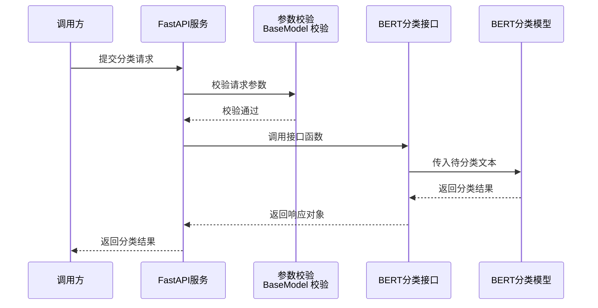
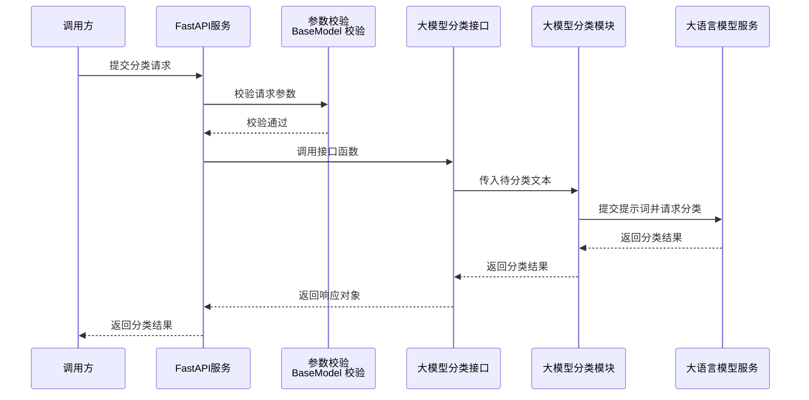

### 1. 正则分类接口：`POST /v1/text-cls/regex`

```mermaid
sequenceDiagram
    participant 调用方
    participant FastAPI服务
    participant 参数校验 as 参数校验<br/>BaseModel 校验
    participant 正则分类接口
    participant 正则分类模型

    调用方->>FastAPI服务: 提交分类请求
    FastAPI服务->>参数校验: 校验请求参数
    参数校验-->>FastAPI服务: 校验通过
    FastAPI服务->>正则分类接口: 调用接口函数
    正则分类接口->>正则分类模型: 传入待分类文本
    正则分类模型-->>正则分类接口: 返回分类结果
    正则分类接口-->>FastAPI服务: 返回响应对象
    FastAPI服务-->>调用方: 返回分类结果
```

### 2. TF-IDF 分类接口：`POST /v1/text-cls/tfidf`

```mermaid
sequenceDiagram
    participant 调用方
    participant FastAPI服务
    participant 参数校验 as 参数校验<br/>BaseModel 校验
    participant TFIDF分类接口
    participant TFIDF分类模型

    调用方->>FastAPI服务: 提交分类请求
    FastAPI服务->>参数校验: 校验请求参数
    参数校验-->>FastAPI服务: 校验通过
    FastAPI服务->>TFIDF分类接口: 调用接口函数
    TFIDF分类接口->>TFIDF分类模型: 传入待分类文本
    TFIDF分类模型-->>TFIDF分类接口: 返回分类结果
    TFIDF分类接口-->>FastAPI服务: 返回响应对象
    FastAPI服务-->>调用方: 返回分类结果
```

### 3. BERT 分类接口：`POST /v1/text-cls/bert`

```mermaid
sequenceDiagram
    participant 调用方
    participant FastAPI服务
    participant 参数校验 as 参数校验<br/>BaseModel 校验
    participant BERT分类接口
    participant BERT分类模型

    调用方->>FastAPI服务: 提交分类请求
    FastAPI服务->>参数校验: 校验请求参数
    参数校验-->>FastAPI服务: 校验通过
    FastAPI服务->>BERT分类接口: 调用接口函数
    BERT分类接口->>BERT分类模型: 传入待分类文本
    BERT分类模型-->>BERT分类接口: 返回分类结果
    BERT分类接口-->>FastAPI服务: 返回响应对象
    FastAPI服务-->>调用方: 返回分类结果
```

### 4. 大模型分类接口：`POST /v1/text-cls/gpt`

```mermaid
sequenceDiagram
    participant 调用方
    participant FastAPI服务
    participant 参数校验 as 参数校验<br/>BaseModel 校验
    participant 大模型分类接口
    participant 大模型分类模块
    participant 大语言模型服务

    调用方->>FastAPI服务: 提交分类请求
    FastAPI服务->>参数校验: 校验请求参数
    参数校验-->>FastAPI服务: 校验通过
    FastAPI服务->>大模型分类接口: 调用接口函数
    大模型分类接口->>大模型分类模块: 传入待分类文本
    大模型分类模块->>大语言模型服务: 提交提示词并请求分类
    大语言模型服务-->>大模型分类模块: 返回分类结果
    大模型分类模块-->>大模型分类接口: 返回分类结果
    大模型分类接口-->>FastAPI服务: 返回响应对象
    FastAPI服务-->>调用方: 返回分类结果
```

