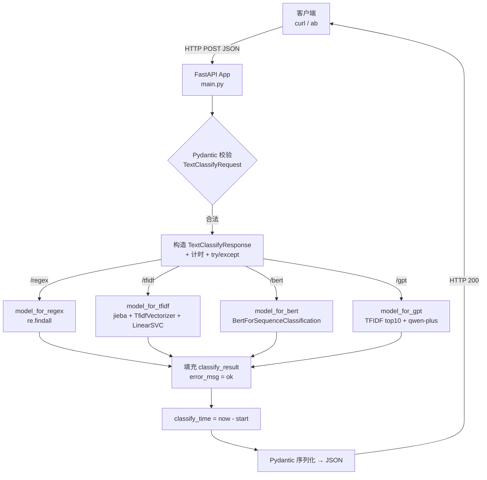
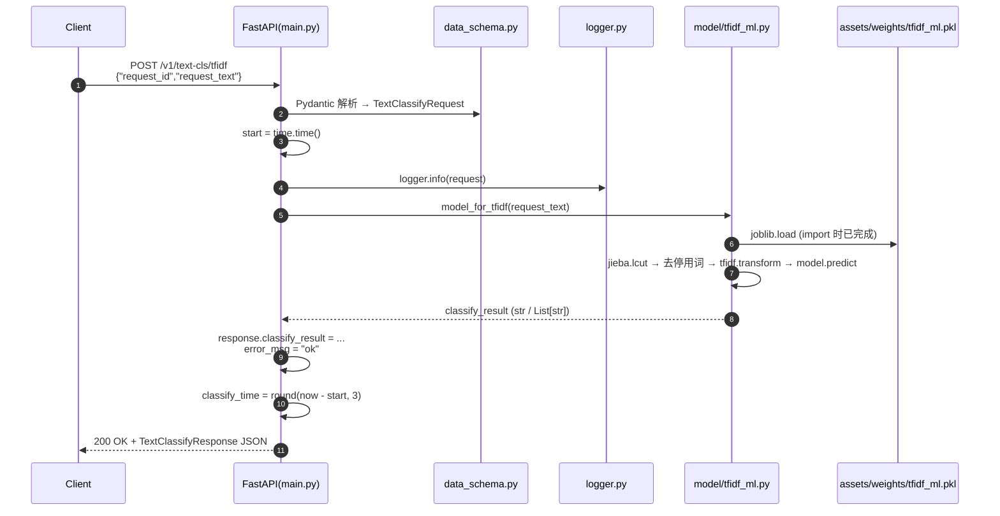
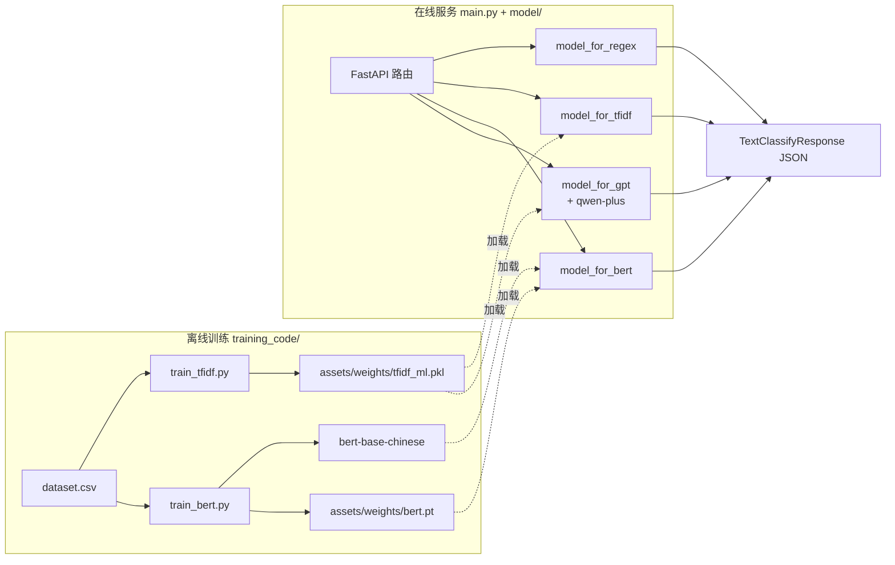
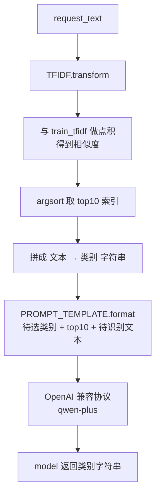

# 01-intent-classify 流程图

> 项目根目录：`E:\persion_center\study\aboat_ai\study_related\Week03\01-intent-classify`
> 整体定位：基于 **FastAPI** 的意图识别推理服务，对外提供 4 种分类能力（**regex / tfidf / bert / gpt**），覆盖「规则 → 传统 ML → 深度学习 → 大模型」四条技术路线。

---

## 一、源文件作用梳理

### 1. 服务入口层（根目录）

| 文件 | 作用 |
|---|---|
| `main.py` | **FastAPI 服务主入口**。定义 4 个 `POST` 接口（`/v1/text-cls/regex`、`/tfidf`、`/bert`、`/gpt`），负责**请求体解析 → 调用对应模型 → 异常兜底 → 构造统一 `TextClassifyResponse` → 返回 JSON**。每个接口都封装了"计时 + try/except + 日志"模板。 |
| `fastapi_demp.py` | **FastAPI 最小 Demo**，仅作 HTTP 路由示例（`GET /`、`GET /items/{item_id}`），与主服务无运行时依赖。 |
| `config.py` | **全局配置中心**。包含：① `REGEX_RULE` 正则规则字典；② `CATEGORY_NAME` 12 个意图类别列表；③ 各类模型权重路径（`TFIDF_MODEL_PKL_PATH`、`BERT_MODEL_PKL_PATH`、`BERT_MODEL_PERTRAINED_PATH`）；④ LLM 调用配置（`LLM_OPENAI_SERVER_URL`、`LLM_OPENAI_API_KEY`、`LLM_MODEL_NAME="qwen-plus"`）。 |
| `data_schema.py` | **Pydantic 数据契约**。定义 `TextClassifyRequest`（`request_id`、`request_text`）和 `TextClassifyResponse`（回填 `classify_result`、`classify_time`、`error_msg`），是请求/响应的"协议层"。 |
| `logger.py` | **日志初始化**。`logging.basicConfig` 同时输出到 `app.log` 文件与控制台，导出全局 `logger`。 |
| `README.md` | 项目说明 + 训练/启动/压测命令速查。 |
| `app.log` | 运行期日志落盘文件（由 `logger.py` 生成）。 |

### 2. 模型推理层（`model/` 目录）

| 文件 | 作用 | 加载的"模型" |
|---|---|---|
| `model/regex_rule.py` | **规则匹配**。模块加载时把 `REGEX_RULE` 编译成 `re.compile` 模式；`model_for_regex()` 遍历每个类别查 `findall`，命中即标为该类别，零命中归 `Other`。 | `re` 正则对象（内存中） |
| `model/tfidf_ml.py` | **传统 ML 路线**。模块加载时 `joblib.load(TFIDF_MODEL_PKL_PATH)` 加载训练好的 `(TfidfVectorizer, LinearSVC)` 二元组，并拉取百度停用词表。推理流程：jieba 分词 → 去停用词 → `tfidf.transform` → `model.predict`。 | `assets/weights/tfidf_ml.pkl` |
| `model/bert.py` | **深度学习路线**。模块加载时基于 `bert-base-chinese` 初始化 `BertForSequenceClassification(num_labels=12)`，再 `torch.load(BERT_MODEL_PKL_PATH)` 加载微调权重到 GPU/CPU。推理流程：tokenizer 编码 → `DataLoader` 批处理 → `model.eval()` 前向 → `argmax` → 映射到 `CATEGORY_NAME`。 | `assets/weights/bert.pt` + `assets/models/bert-base-chinese/` |
| `model/prompt.py` | **大模型 + Few-shot 路线**。先加载 `tfidf_ml.pkl`，对训练集 `dataset.csv` 做一次 TFIDF 预计算；推理时用 TFIDF 相似度在训练集中检索 **top10 最相似样本**作为示例，拼进 `PROMPT_TEMPLATE`（动态提示词），再调用 OpenAI 兼容协议（实际是阿里 DashScope `qwen-plus`）做生成式分类。 | TFIDF + 远程 LLM（API 调用） |

### 3. 训练层（`training_code/` 目录，离线运行）

| 文件 | 作用 |
|---|---|
| `training_code/train_tfidf.py` | 读 `assets/dataset/dataset.csv`，jieba + 停用词 → `TfidfVectorizer(ngram_range=(1,1))` → `LinearSVC` 训练 → `joblib.dump` 保存为 `assets/weights/tfidf_ml.pkl`。 |
| `training_code/train_bert.py` | 读前 500 条数据，`LabelEncoder` 编码 → 切分训练/测试集 → 用 `bert-base-chinese` + `Trainer` 微调 4 个 epoch → 取最优 checkpoint，保存 `state_dict` 到 `assets/weights/bert.pt`。 |

### 4. 测试 / 文档 / 资源

| 文件 / 目录 | 作用 |
|---|---|
| `test/data.json` | 压测请求样例 `{"request_id":"string","request_text":"帮我播放周杰伦的歌曲"}`。 |
| `doc/01_项目背景文档.md` ~ `04_项目面试点.md` | 项目背景、实施、运维、面试问答四份说明。 |
| `assets/dataset/` | 训练数据 `dataset.csv` + 停用词 `baidu_stopwords.txt`。 |
| `assets/weights/` | 训练产物（`.pkl`、`.pt`），由训练脚本生成。 |
| `assets/models/bert-base-chinese/` | 预训练 BERT 权重（需自行下载）。 |
| `logs/` | TensorBoard 训练日志（`events.out.tfevents.*`）。 |

---

## 二、FastAPI 请求 → 返回的端到端流程

> 4 个接口的"骨架"完全相同，仅 **第 4 步调用的模型函数**不同。

```
[客户端] --HTTP POST + JSON--> FastAPI
                                │
                                ▼
        ① Pydantic 自动反序列化   data_schema.TextClassifyRequest
           (校验 request_id / request_text 类型)
                                │
                                ▼
        ② 启动计时 start = time.time()
                                │
                                ▼
        ③ 构造空响应壳   TextClassifyResponse(
                request_id, request_text,
                classify_result="", classify_time=0, error_msg="")
                                │
                                ▼
        ④ logger.info(...) 打印请求
                                │
                                ▼
        ⑤ try:
              调用模型函数  ◀──┬── model_for_regex   (正则)
                  │           ├── model_for_tfidf    (TFIDF + LinearSVC)
                  │           ├── model_for_bert     (BertForSequenceClassification)
                  │           └── model_for_gpt      (TFIDF检索top10 + qwen-plus)
                  ▼
              response.classify_result = 返回值
              response.error_msg       = "ok"
           except Exception:
              response.classify_result = ""
              response.error_msg       = traceback.format_exc()
                                │
                                ▼
        ⑥ response.classify_time = round(time.time() - start, 3)
                                │
                                ▼
        ⑦ FastAPI 把对象用 Pydantic 序列化为 JSON → HTTP 200
                                │
                                ▼
                           [客户端]
```

### 关键设计点
1. **统一外壳**：`main.py` 里 4 个 handler 几乎复制粘贴，确保 `error_msg`/`classify_time` 字段始终返回，便于上游做监控与对账。
2. **类型驱动**：仅靠 Pydantic 模型，FastAPI 自动完成 JSON ↔ Python 对象互转、`Union[str, List[str]]` 也支持。
3. **全局单例**：`model/*.py` 在 import 时就把模型/正则编译好，**避免每个请求重复加载**（首次 import 加载，后续请求零成本）。
4. **路由 → 模型映射**（HTTP method × 算法）：

| URL | Handler | 模型函数 | 技术栈 |
|---|---|---|---|
| `POST /v1/text-cls/regex` | `regex_classify` | `model_for_regex` | 纯正则 |
| `POST /v1/text-cls/tfidf` | `tfidf_classify` | `model_for_tfidf` | TFIDF + LinearSVC |
| `POST /v1/text-cls/bert`  | `bert_classify`  | `model_for_bert`  | bert-base-chinese 微调 |
| `POST /v1/text-cls/gpt`   | `gpt_classify`   | `model_for_gpt`   | TFIDF 检索 + qwen-plus (Few-shot) |

---

## 三、流程图

### 1. 整体架构图（4 路由 × 4 模型）



### 2. 单次请求时序图（以 `/v1/text-cls/tfidf` 为例）



### 3. 离线训练 + 在线推理 总览图



### 4. GPT 路线专属细节（Few-shot 动态提示词）



---

## 四、一句话总结

> **`main.py` 是 HTTP 协议层、`data_schema.py` 是数据契约层、`config.py` 是配置中心、`model/*.py` 是 4 种推理实现（其中 `regex` 纯规则、`tfidf` 传统 ML、`bert` 深度学习、`gpt` 检索增强的大模型），`training_code/*.py` 是离线训练脚本，模型权重通过 `config.py` 路径被推理模块在 import 时一次性加载，请求来临时只做"计时 → 调模型 → 兜底异常 → 计时 → 返回 JSON"的薄壳流程。**
