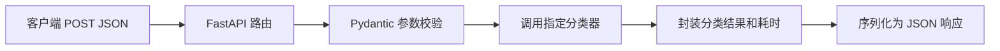

# 第三周作业

## 作业 1：LangChain 与 OpenAI Agents

### LangChain 工具调用和 LLM Function Call 有什么区别？

#### LLM Function Call

LLM Function Call 是模型服务商提供的底层协议能力。程序把工具名称、说明和 JSON Schema 发送给模型；模型不会真的执行 Python 函数，只会返回类似下面的工具调用意图：

```json
{
  "name": "get_weather",
  "arguments": {"location": "北京"}
}
```

开发者需要自行完成以下步骤：

1. 解析模型返回的函数名和参数。
2. 找到并执行对应的本地函数或外部 API。
3. 把工具执行结果作为 `tool` 消息放回对话。
4. 再次调用模型生成最终回答。

#### LangChain 工具调用

LangChain 工具调用是对不同模型 Function Call 协议的上层封装。它最终仍然依赖模型本身支持工具调用，但 LangChain 提供了统一的编程接口：

- `@tool` 自动把 Python 函数、类型标注和 docstring 转成工具 Schema。
- `model.bind_tools()` 将工具绑定到模型。
- `AIMessage.tool_calls` 将不同服务商返回值统一成相同结构。
- `BaseTool.invoke()` 负责参数校验和函数执行。
- `create_agent()` 或 LangGraph 可以继续负责循环调用、状态、记忆、中间件和错误处理。

因此，两者不是互相替代的技术：**Function Call 是底层模型协议，LangChain Tool Calling 是建立在该协议上的统一封装和编排层。**

| 对比项 | LLM Function Call | LangChain 工具调用 |
|---|---|---|
| 所在层次 | 模型 API/协议层 | 应用框架/编排层 |
| 工具定义 | 手写 JSON Schema | 可由 `@tool` 自动生成 |
| 返回类型 | 服务商原始 `tool_calls` | 统一的 `AIMessage.tool_calls` |
| 工具执行 | 开发者自行分发执行 | `tool.invoke()` 或 Agent 自动执行 |
| 多模型适配 | 需要分别处理差异 | LangChain 提供较统一接口 |
| Agent 循环 | 自己实现 | 可由 Agent/LangGraph 管理 |
| 额外开销 | 最少 | 多一层转换、校验与回调开销 |

### 3. LangChain 工具调用的速度受什么影响？

一次完整工具调用通常是：

```text
第一次模型请求（选择工具和生成参数）
→ 执行工具
→ 第二次模型请求（根据工具结果汇总回答）
```

主要影响因素按通常的重要程度排列如下：

1. **大模型响应时间**：模型大小、推理复杂度、服务商负载、是否启用深度思考都会影响首 Token 和完整响应时间。
2. **模型往返次数**：每轮“选择工具 → 执行 → 汇总”至少需要两次模型请求；Agent 多轮规划、重试或连续调用工具会继续增加请求次数。
3. **网络与服务区域**：本机到模型 API 的网络延迟、丢包、代理、跨区域访问和 TLS 建连时间都会影响速度。
4. **工具自身耗时**：本地字典查询非常快；数据库、网页搜索、第三方 API、文件处理或复杂计算可能成为主要瓶颈。
5. **工具是并行还是串行**：北京、上海、武汉三个互不依赖的查询若并行执行，通常比逐个执行更快。
6. **上下文和工具 Schema 大小**：历史消息越长、工具数量越多、Schema 越复杂，输入 Token 越多，模型理解和传输所需时间越长。
7. **输出长度**：工具参数和最终答案生成的 Token 越多，耗时通常越长。
8. **限流、重试与冷启动**：API 限流、超时重试、服务冷启动会造成明显抖动。
9. **LangChain 框架开销**：消息转换、Pydantic 校验、回调、Tracing 和序列化也会耗时，但在远程 LLM 调用中通常远小于模型和网络耗时。

#### 对课程代码的具体分析

课程原代码实际发起了三次模型请求：

1. `invoke(messages)`：让模型选择天气工具并生成三个城市参数。
2. `stream(messages)`：再次请求模型，只为了展示流式工具调用片段。
3. 执行本地天气函数后再次 `invoke(messages)`：生成最终汇总。

其中第二次请求和第一次功能重复，会额外增加一次完整网络与模型延迟。如果目标只是得到最终结果，可以去掉该 `stream()` 演示。三个天气函数都是本地字典判断，耗时很小，所以该示例的总速度主要由两到三次 LLM API 调用决定。

安全版脚本会分别打印“模型选择工具”“本地执行工具”和“模型汇总答案”的耗时，便于观察瓶颈。

## 作业 2：意图识别项目

已完成对 `01-intent-classify` 项目的逐文件阅读和调用链分析，详细内容见：

- [作业2_意图识别流程.md](./作业2_意图识别流程.md)

该项目通过 FastAPI 提供正则、TF-IDF + LinearSVC、BERT 和 GPT 四种意图分类接口。一次请求的主流程为：



需要注意：课程目录当前缺少配置中指定的 TF-IDF 权重、BERT 权重和本地 BERT 模型，因此项目源码按现状不能完整启动。详细报告中还记录了列表正则匹配错误、远程停用词依赖、异常响应和 API Key 管理等问题。
