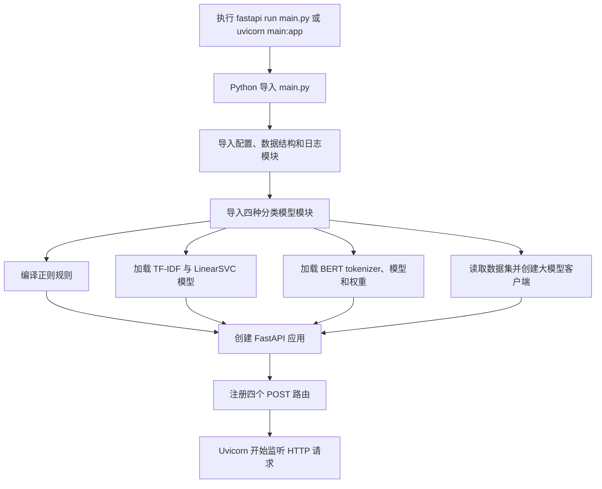
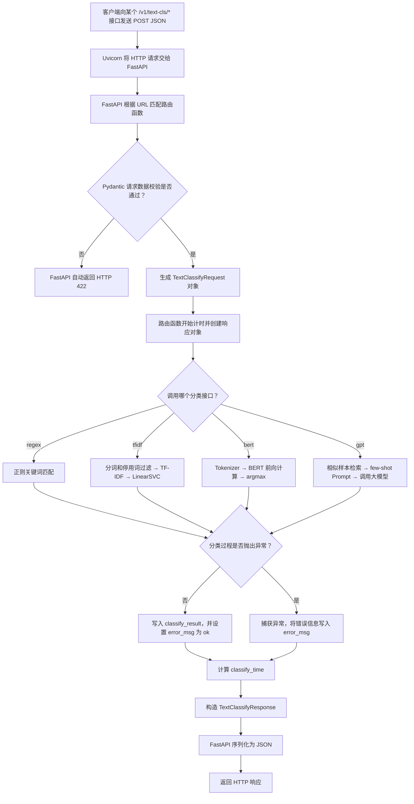

# 作业2：意图识别项目源码梳理

## 一、项目功能概述

`01-intent-classify` 是一个基于 FastAPI 的文本意图识别服务。客户端提交一段文本后，可以选择四种分类方法：

| 接口 | 分类方法 | 核心思路 |
|---|---|---|
| `/v1/text-cls/regex` | 正则规则 | 根据关键词匹配意图 |
| `/v1/text-cls/tfidf` | TF-IDF + LinearSVC | 将文本向量化后，用传统机器学习模型分类 |
| `/v1/text-cls/bert` | BERT | 使用微调后的中文 BERT 模型分类 |
| `/v1/text-cls/gpt` | 大语言模型 | 检索相似样本组成 few-shot 提示词，再调用大模型分类 |

项目定义了 12 种意图，包括音乐播放、影视播放、天气查询、家电控制、日历查询和其他类型等。

## 二、源文件作用

### 1. 服务入口及公共模块

| 文件 | 作用 |
|---|---|
| `main.py` | FastAPI 服务入口，创建应用，注册四个 POST 接口，调用相应分类器，并封装返回结果。 |
| `data_schema.py` | 使用 Pydantic 定义请求体 `TextClassifyRequest` 和响应体 `TextClassifyResponse`。 |
| `config.py` | 保存意图类别、正则规则、模型文件路径及大模型连接配置。 |
| `logger.py` | 配置日志，将日志同时输出到控制台和 `app.log`。 |
| `fastapi_demp.py` | FastAPI 基础示例，只包含简单 GET 接口，不参与正式意图识别流程。 |

### 2. 推理模块

| 文件 | 作用 |
|---|---|
| `model/regex_rule.py` | 预编译关键词正则表达式，根据文本中出现的关键词返回对应意图；没有匹配时返回 `Other`。 |
| `model/tfidf_ml.py` | 对文本进行 jieba 分词和停用词过滤，再调用已训练的 TF-IDF 向量器与 LinearSVC 模型进行预测。 |
| `model/bert.py` | 加载中文 BERT、分类权重和 tokenizer，将文本编码后执行神经网络推理并返回类别。 |
| `model/prompt.py` | 先使用 TF-IDF 检索最相似的 10 条训练样本，组成 few-shot 提示词，再调用大模型判断意图。 |

### 3. 训练、数据和测试文件

| 文件或目录 | 作用 |
|---|---|
| `training_code/train_tfidf.py` | 读取训练集，训练 TF-IDF + LinearSVC，并保存 `tfidf_ml.pkl`。 |
| `training_code/train_bert.py` | 使用训练数据微调 BERT，并保存分类模型权重 `bert.pt`。 |
| `assets/dataset/dataset.csv` | 意图分类训练数据。 |
| `assets/dataset/baidu_stopwords.txt` | 中文停用词表。 |
| `test/data.json` | API 请求示例数据。 |
| `doc/` | 项目背景、模型方案和部署运行说明。 |
| `logs/`、`__pycache__/` | 运行时产生的日志和 Python 缓存，不属于核心源代码。 |

## 三、服务启动流程

运行命令示例：

```powershell
cd "C:\Users\haozh\Desktop\cours\AI_cours\第03周-语言模型与Agent基础\01-intent-classify\01-intent-classify"
fastapi run main.py
```

也可以使用：

```powershell
uvicorn main:app --host 0.0.0.0 --port 8000
```

启动过程如下：



这里采用的是“启动时加载”方式：`main.py` 导入模型模块时，TF-IDF 和 BERT 等资源就会被加载，而不是等请求到达后再加载。优点是请求到达后无需重复加载模型；缺点是任意一个模型文件缺失，都可能使整个服务无法启动。

## 四、从 FastAPI 接收请求到返回结果的流程

### 1. 总体流程图



### 2. 自然语言描述

1. 客户端向四个意图识别接口之一发送 POST 请求，请求体中包含 `request_id` 和 `request_text`。
2. Uvicorn 接收 HTTP 请求，并将其交给 FastAPI。
3. FastAPI 根据 URL 找到 `main.py` 中对应的路由函数。
4. Pydantic 使用 `TextClassifyRequest` 对 JSON 进行类型和必填项校验。校验失败时，FastAPI 直接返回 422，不进入分类函数。
5. 校验通过后，路由函数记录开始时间并创建 `TextClassifyResponse`。
6. 路由函数根据所调用的接口，分别执行正则、TF-IDF、BERT 或 GPT 分类。
7. 分类成功时，将预测类别写入 `classify_result`，并把 `error_msg` 设置为 `ok`。
8. 分类过程出现异常时，`except` 会捕获异常并把错误信息写入响应。
9. 路由函数计算分类耗时，FastAPI 根据响应模型将 Python 对象序列化为 JSON，并返回客户端。

## 五、四种分类分支的内部流程

### 正则分类

```text
输入文本
→ 遍历预编译的关键词正则表达式
→ 收集所有匹配到的意图
→ 如果没有匹配则返回 Other
```

### TF-IDF 分类

```text
输入文本
→ jieba 分词
→ 去除停用词
→ TF-IDF 向量化
→ LinearSVC.predict()
→ 返回意图类别
```

### BERT 分类

```text
输入文本
→ BertTokenizer 编码
→ Dataset 和 DataLoader 生成张量
→ 张量移动到 CPU 或 GPU
→ BERT 前向计算得到 logits
→ argmax 得到类别编号
→ 映射为意图名称
```

### GPT 分类

```text
输入文本
→ 使用 TF-IDF 计算它与训练样本的相似度
→ 选择最相似的 10 条带标签样本
→ 组成 few-shot 提示词
→ 调用大语言模型
→ 返回模型生成的意图名称
```

## 六、源码检查中发现的问题

1. **当前目录缺少模型资源。** 配置要求使用 `assets/weights/tfidf_ml.pkl`、`assets/weights/bert.pt` 和 `assets/models/bert-base-chinese/`，但给出的项目目录中没有这些文件或目录。因此源码按现状启动时，会在导入模型模块阶段失败。需要先运行训练脚本或补齐老师提供的模型文件。

2. **所有模型在启动时被强制加载。** 即使只想使用正则接口，也必须成功加载 TF-IDF、BERT 和 GPT 模块。可改为按需加载模型，避免一个模型的问题导致所有接口不可用。

3. **正则模型处理列表时存在代码错误。** `regex_rule.py` 的列表分支虽然遍历了单条 `text`，实际却把整个 `request_text` 列表传给正则表达式，可能出现类型错误。应对当前的 `text` 执行匹配。

4. **TF-IDF 推理模块依赖远程停用词地址。** 项目已经包含本地停用词文件，但推理代码仍从网络下载停用词。网络不可用时会影响服务启动，建议直接读取本地文件。

5. **接口异常状态不够规范。** 分类内部异常被捕获后仍会正常返回响应，通常 HTTP 状态仍为 200，而且响应中包含完整 traceback。生产环境中应返回合适的 5xx 状态并避免向客户端泄露内部堆栈。

6. **配置文件中不应保存真实 API Key。** API Key 应放入不提交 Git 的 `.env` 文件，通过环境变量读取；如果密钥曾经提交到仓库，应立即在服务商控制台撤销并重新生成。

7. **BERT 标签映射需要核对。** 训练代码用 `LabelEncoder` 生成类别编号，而推理代码用 `CATEGORY_NAME` 列表还原标签。两者顺序不一致时，模型即使预测编号正确，也可能输出错误的意图名称。

## 七、总结

该项目用统一的 FastAPI 接口展示了从简单规则、传统机器学习、深度学习到大语言模型的四种意图识别方案。HTTP 层和响应结构基本一致，差异主要位于模型推理部分。完整链路可以概括为：

```text
客户端请求
→ FastAPI 路由与 Pydantic 校验
→ 调用指定分类器
→ 捕获结果或异常
→ 记录耗时
→ 序列化响应
→ 返回客户端
```
