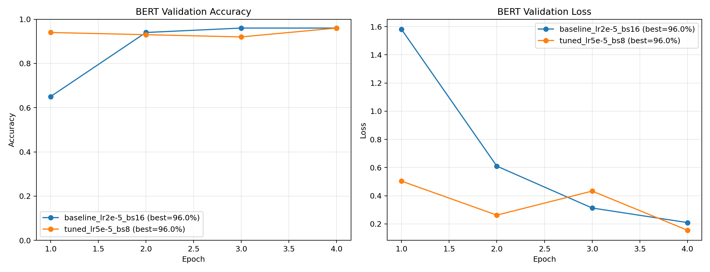

# 作业1：BERT 文本分类微调实验

固定条件：前500条数据、随机种子42、8:2分层划分、4 epochs、max_length=64。

| 实验 | 学习率 | Batch size | 最佳测试准确率 | 耗时(s) |
|---|---:|---:|---:|---:|
| baseline_lr2e-5_bs16 | 2e-05 | 16 | 96.00% | 14.86 |
| tuned_lr5e-5_bs8 | 5e-05 | 8 | 96.00% | 19.43 |

## 微调过程理解

文本先经 BERT tokenizer 转为 input_ids 与 attention_mask；预训练 BERT 输出语义表示，分类头产生各类别 logits；交叉熵损失衡量预测与标签差异；反向传播同时更新分类头和 BERT 权重；每轮在固定测试集计算 accuracy，最终保存模型和实验指标。

