## 作业

## 1、本地配置下es，基于es完成下全文检索、条件过滤、向量检索，截图。

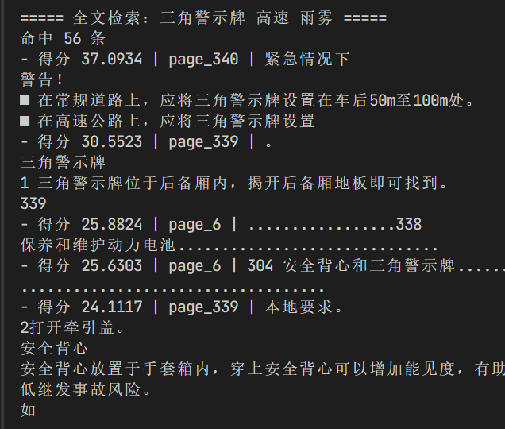

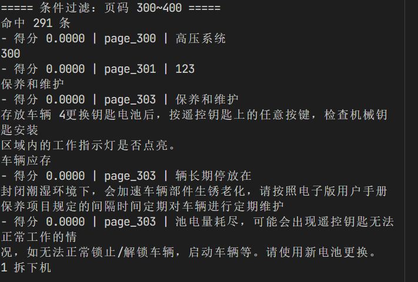

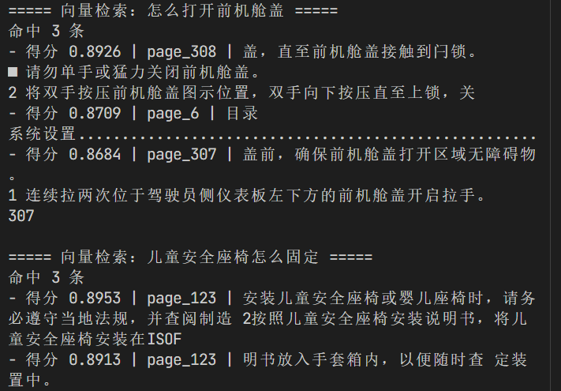

## 2、跑通rag 01 - 08 代码，截图。

### 01

模拟知识库检索 然后是固定的页面内容和问题 使用的方式是读取第一个问题和第xx页的内容

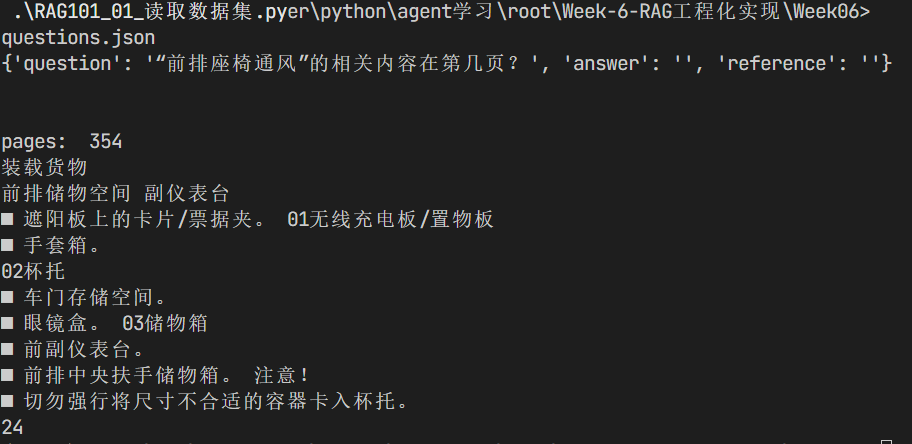

### 02

把所用的问题jieba分词后 使用TFIDF 计算和pdf哪一页的词频相关性 **找出与每个问题最相关的Top-1和Top-10页面**

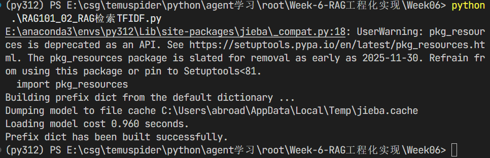

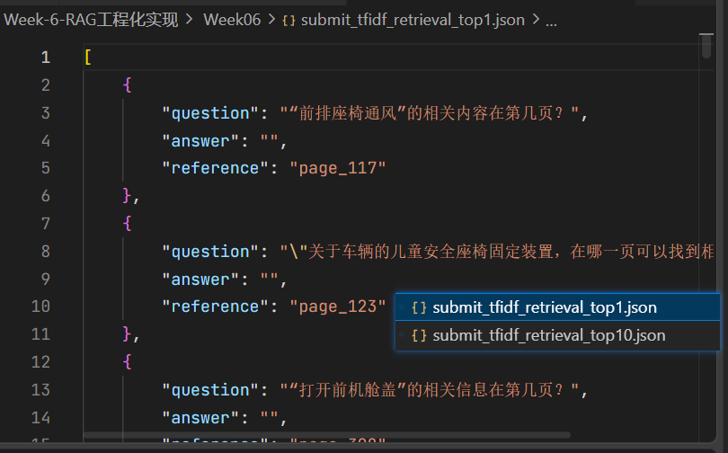

### 03

同02 但是换成BM25

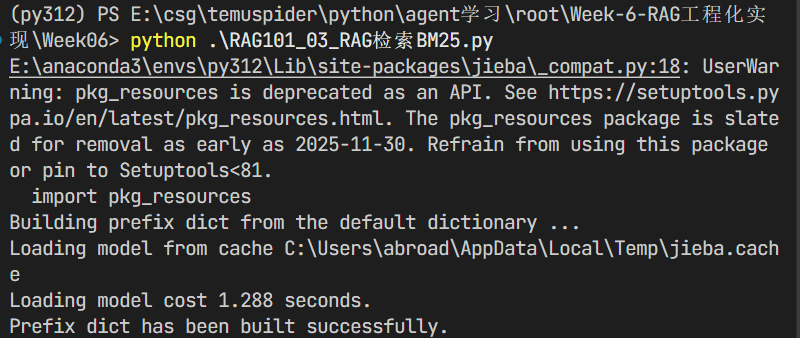

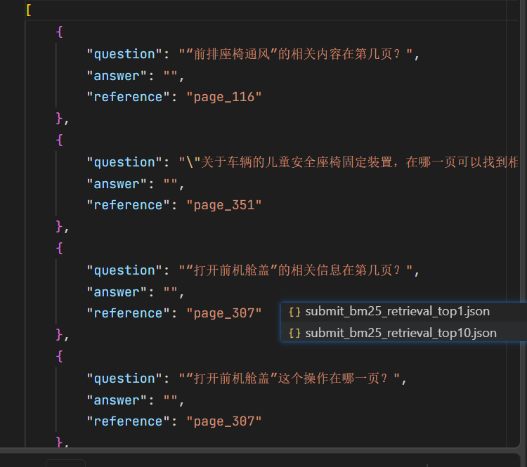

### 04

同03 但是换成了语义理解 bge

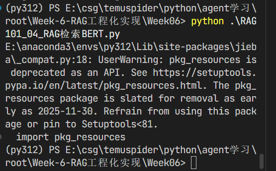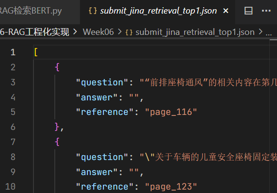

### 05 相对04添加了chunk划分 同时使用页数去重来防止同一页chunk被匹配

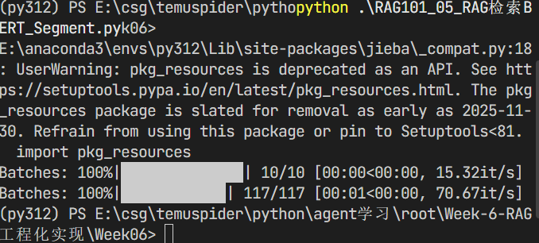

### 06 加入rerank模型

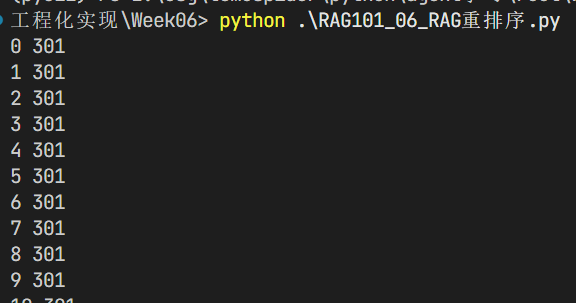

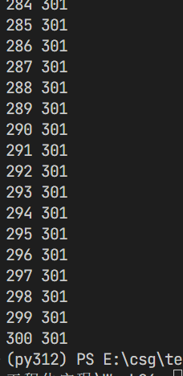

### 07 使用多个检索方式 然后多路召回后**RRF 融合打分** 

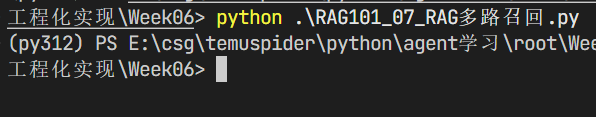

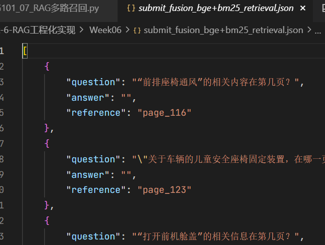

### 08  将rag返回内容和问题 + prompt 交给提示词 返回答案

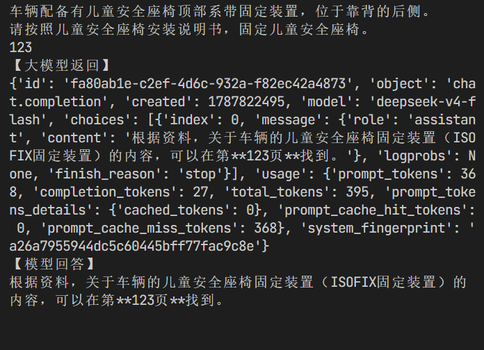